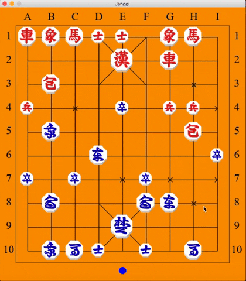

# Janggi-Game

**A playable GUI for games of [Janggi](https://en.wikipedia.org/wiki/Janggi) (Korean chess)**

Running ``JanggiGUI.py`` imports the game logic from ``JanggiGame.py`` and displays a simple GUI using Pygame.

Demonstration:

## Key OOP concepts put into practice:

* classes and objects (used for the game and various game pieces)
* inheritance (each specific game piece is a child of the Piece class)
* composition (all Pieces are able to use methods from the JanggiGame class)

**Other valuable concepts:**

* unit testing
* importing modules
* implementation of game logic (specifically, move sets)
* data validation for each potential move scenario (based on the rules of Janggi)

## What I learned:

* I need to thoroughly read the documentation!! Looking at you, Pygame...
* PyCharm's debugger is incredibly powerful
* unit tests save time, though they can be frustrating
* creating a visual representation is paramount to success
* my whiteboard is my best friend

## In development:

* AI with variable difficulty

## Future goals:

* resizeable game window
* toggle to translate pieces
* highlight valid moves on click
